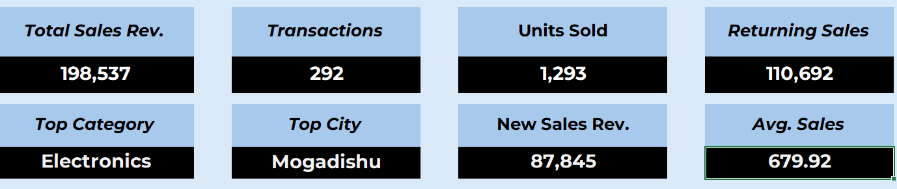

# SCREENSHOTS

This folder contains the **visual evidence** for the *Customer Purchase & Sales Performance Analysis* project: the formal written report (`Overview.pdf`) plus six standalone PNG screenshots captured directly from the `Dashboard` and `Pivot Tables` sheets of [`../DATASET/dataset.xlsx`](../DATASET/README.md). Together they let you see every KPI, chart, and pivot table without opening Excel.

| File | Type | Size |
|---|---|---|
| `Overview.pdf` | 5-page written project report | ~215 KB |
| `KPIS.png` | Dashboard KPI cards | ~25 KB |
| `PIVOT TABLE.png` | All 5 PivotTables | ~66 KB |
| `SALES BY MONTHS.png` | Dashboard chart | ~44 KB |
| `SALES BY CITY.png` | Dashboard chart | ~61 KB |
| `CURRENT YEAR VS PRIOR YEAR.png` | Dashboard chart | ~46 KB |
| `NEW VS RETURNING.png` | Dashboard chart | ~46 KB |

**Author:** Abdikarim Ismail Ali · **Year:** 2026

## Purpose

Where [DATASET](../DATASET/README.md) is the interactive, working analysis and [PPT](../PPT/README.md) is the narrated executive deck, this folder is the **visual record**: static, shareable proof of what the workbook's dashboard actually looks like and what numbers it produces, plus the full written report that explains them.

## The screenshots

### `KPIS.png` — Dashboard KPI cards

The 8-card KPI strip from the top of the `Dashboard` sheet:

| Total Sales Rev. | Transactions | Units Sold | Returning Sales |
|---|---|---|---|
| 198,537 | 292 | 1,293 | 110,692 |

| Top Category | Top City | New Sales Rev. | Avg. Sales |
|---|---|---|---|
| Electronics | Mogadishu | 87,845 | 679.92 |

### `PIVOT TABLE.png` — All 5 PivotTables

A single screenshot capturing every PivotTable from the `Pivot Tables` sheet side by side (values = Sum of Unit_Price, USD):

- **By Category:** Electronics $16,457.43 leads, then Home & Living $3,361.23, Clothing $2,742.41, Groceries $1,412.37, Other $1,048.69, Stationery $250.89 → Grand Total $25,273.02
- **By City:** Mogadishu $9,405.35 leads, then Other $3,157.38, Hargeisa $3,657.37, Bosaso $3,620.11, Kismayo $2,160.22, Baidoa $2,259.81, Garowe $1,012.78
- **By Customer Type:** Returning $15,724.98 vs. New $9,548.04
- **By Year:** 2025 $17,428.18, 2026 $6,005.01, 2099 $1,839.83 *(data-entry error year, flagged for source correction)*
- **By Month:** Jun peaks at $4,601.28; Nov is lowest at $804.01

### `SALES BY MONTHS.png` — "Sales By Months (2025-26)" chart

Column chart of monthly `Sum of Unit_Price`, one color per month, with the **Months** slicer visible above it (Jan–Dec, all selected). June is the tallest bar (~$4,600); November the shortest (~$800).

### `SALES BY CITY.png` — "Sales By City" chart

3D column chart of `Sum of Unit_Price` by city, with the **Years**, **City**, and **Product_Category** slicers visible on the left. Mogadishu towers over the rest (~$9,400); Garowe is the smallest (~$1,000).

### `CURRENT YEAR VS PRIOR YEAR.png` — "Current Year Vs. Prior Year And No-Date" chart

Two-bar comparison of 2025 (~$17,400, purple) vs. 2026 (~$6,000, green), with the same three slicers on the left. Note: the **Years** slicer only offers `2025`/`2026` as selectable options here — the invalid `2099` records are excluded from this particular chart's slicer, even though they still appear in the `Pivot Tables` sheet's Year breakdown.

### `NEW VS RETURNING.png` — "New Vs. Returning Customers" chart

Two-bar comparison of `Customer_Type`: New (~$9,500, dark green) vs. Returning (~$15,700, red), with the Years/City/Product_Category slicers on the left. Confirms returning customers drive noticeably more revenue than new ones.

## `Overview.pdf` — the written report

A 5-page, self-contained project report that includes screenshots of the workbook inline. Page-by-page:

### Page 1 — Cover
Title page: **"Customer Purchase & Sales Performance Analysis — Project Report."** Subtitle: *Data Cleaning • Analysis • Interactive Dashboard (Excel)*. Includes the same KPI summary shown in `KPIS.png`.

### Page 2 — Sections 1–3
- **1. Executive Summary** — cleaned 300 sales records (removing duplicates and errors) and built an interactive dashboard tracking revenue, customers, and categories.
- **2. Objectives** — inspect and log every raw data-quality issue; clean identifiers, dates, categories, and numeric fields; build a filterable KPI dashboard for quick insights.
- **3. Data Quality Issues Found** — the full 12-row audit table (same source as [`Data_Quality_Notes`](../DATASET/README.md#2-data_quality_notes) in the workbook), covering duplicate/missing `Transaction_ID`s, missing `Purchase_Date`s, invalid `Customer_Type`, `Product_Category`, `Quantity`, `City`, and `Unit_Price` values.

### Page 3 — Section 4: Data Cleaning Methodology
- Missing IDs replaced with traceable row-based placeholders (concatenation of `"MISSING"` + row number).
- Duplicate rows reviewed; the most complete record in each group was kept.
- Invalid values corrected, standardized, or flagged for review.
- **Fig. 1** — the duplicate `Transaction_ID` groups identified in the workbook.
- **Fig. 2** — the missing-ID and missing-date resolution tables (the `Problems` sheet).

### Page 4 — Section 5: Dashboard: KPIs, Charts & Slicers
- **Fig. 3** — full screenshot of the interactive `Dashboard` sheet, including all four slicers and the **Sales By Months**, **Current Year vs. Prior Year and No-Date**, and **Sales By City** charts (the same visuals captured individually in this folder's PNGs).
- Repeats the KPI summary table.

### Page 5 — Sections 6–8
- **6. Key Insights** — Electronics leads sales at roughly four times the next category; Mogadishu leads all cities in tracked sales value; returning customers nearly double new-customer revenue; June peaked, November recorded the lowest sales.
- **7. Recommendations** — correct invalid 2099-dated records at the source; standardize city and category entries at the point of data entry.
- **8. Conclusion** — the raw data is now clean, organized, and dashboard-ready.

## Relationship to the other folders

- Every screenshot here is a static capture of a live, interactive element in [`../DATASET/dataset.xlsx`](../DATASET/README.md) — open the workbook if you want to change the slicers and see these numbers update.
- `KPIS.png`, `SALES BY CITY.png`, `NEW VS RETURNING.png`, `SALES BY MONTHS.png`, and `CURRENT YEAR VS PRIOR YEAR.png` are the same visuals narrated on slides 6–8 of [`../PPT/Presentation.pptx`](../PPT/README.md).
- Use this folder when you want the numbers and charts **without** opening Excel or PowerPoint.

## Requirements to use these files

- Any image viewer for the `.png` screenshots.
- Any standard PDF viewer (Adobe Acrobat, a browser, Preview, etc.) for `Overview.pdf` — no special software required.
