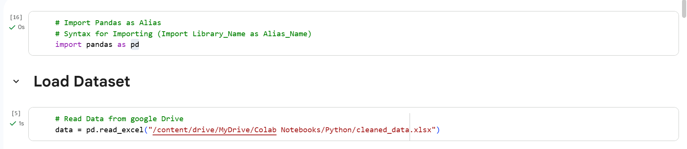
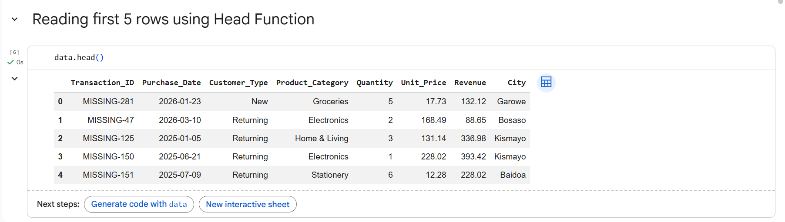
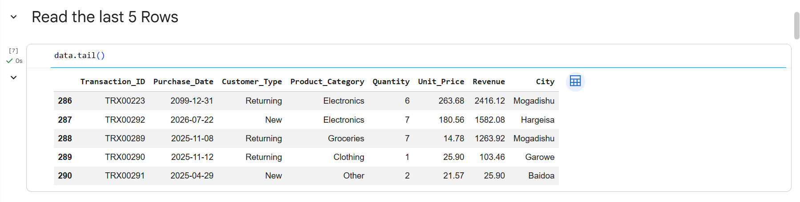
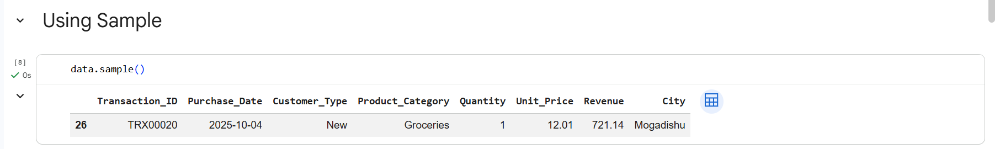
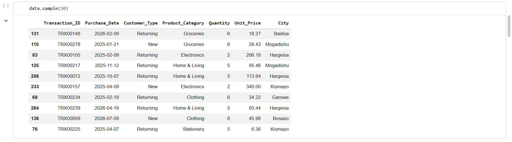
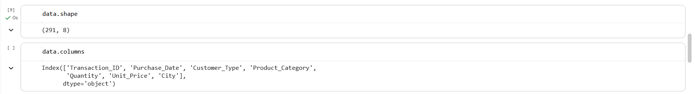
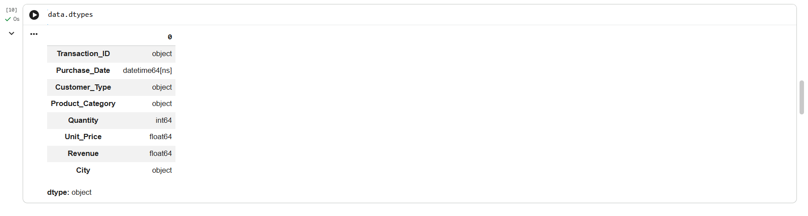
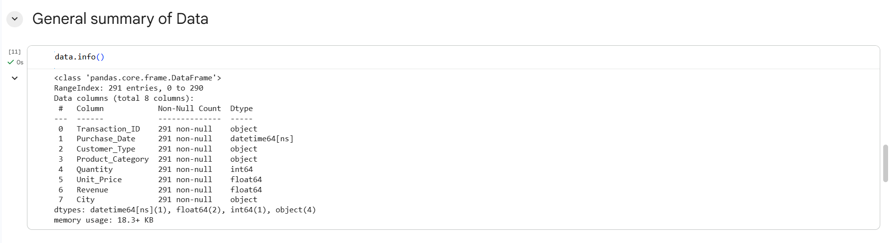
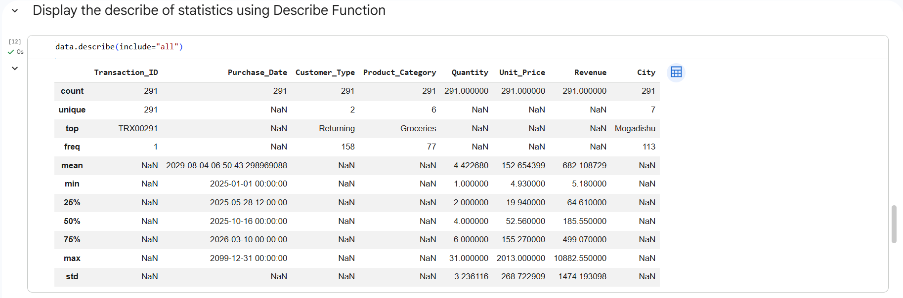
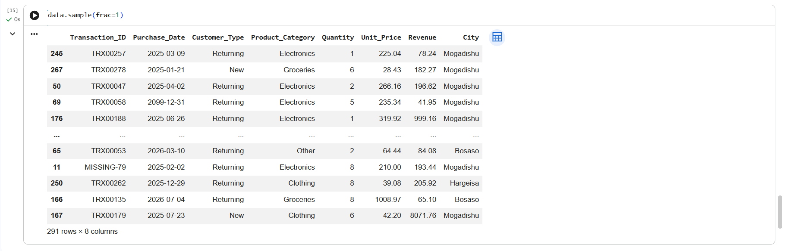

# Screenshots

A step-by-step visual record of [`Basics_day_01.ipynb`](../Dataset/Basics_day_01.ipynb) — every screenshot below is a Colab cell captured exactly as it ran, code and output together, in the order the notebook executes them. Read top to bottom to follow the day 1 lesson from the first `import pandas` to the final statistical summary.

The DataFrame throughout is `data`, loaded from [`../Dataset/cleaned_data.xlsx`](../Dataset/README.md) — **291 rows, 8 columns**: `Transaction_ID`, `Purchase_Date`, `Customer_Type`, `Product_Category`, `Quantity`, `Unit_Price`, `Revenue`, `City`.

| # | Screenshot | Method(s) shown |
|---|---|---|
| 1 | `import-pandas-and-load-dataset.png` | `import pandas as pd`, `pd.read_excel(...)` |
| 2 | `Read-First-5-Row-Using-HeadFN.png` | `data.head()` |
| 3 | `Read-Last-5-Row-Using-TailFN.png` | `data.tail()` |
| 4 | `Using-Sample-Method.png` | `data.sample()` |
| 5 | `Using-sample-to-fetch-10-rows.png` | `data.sample(10)` |
| 6 | `Shape-And-Columns.png` | `data.shape`, `data.columns` |
| 7 | `Using-Columns-To-See-Column_dataTypes.png` | `data.dtypes` |
| 8 | `Using-Info-To-Get-Full-Summary.png` | `data.info()` |
| 9 | `Using-Describe-To-Get-Summarized-Statistics.png` | `data.describe(include="all")` |
| 10 | `Using-Sample-To-Make-Random.png` | `data.sample(frac=1)` |

---

## 1. Import pandas & load the dataset



```python
# Import Pandas as Alias
# Syntax for Importing (Import Library_Name as Alias_Name)
import pandas as pd
```
```python
# Read Data from google Drive
data = pd.read_excel("/content/drive/MyDrive/Colab Notebooks/Python/cleaned_data.xlsx")
```
The notebook runs in Google Colab with Google Drive mounted, so the workbook is read straight from a Drive path rather than a local file. This single call is what turns the Excel file into the `data` DataFrame used by every cell that follows.

## 2. First 5 rows — `data.head()`



By default `head()` returns the top 5 rows. Note rows 0–4 all have a `Transaction_ID` starting with `MISSING-` (e.g. `MISSING-281`, `MISSING-47`) — these are the placeholder IDs assigned during the Excel cleaning stage for records whose original ID was blank, and they happen to sort to the top of this file.

## 3. Last 5 rows — `data.tail()`



`tail()` mirrors `head()` for the bottom of the DataFrame (indices 286–290). Here the `Transaction_ID`s are all genuine `TRX#####` values. Row 286 carries `Purchase_Date = 2099-12-31` — one of the known data-entry-error dates flagged back in the Excel data-quality audit, still visible from the Python side.

## 4. One random row — `data.sample()`



Called with no arguments, `sample()` returns a single random row (index 26 in this run — a `TRX00020` Groceries sale in Mogadishu). Because it's random, re-running the cell returns a different row each time.

## 5. Ten random rows — `data.sample(10)`



Passing an integer to `sample()` returns that many random rows without replacement — used here to eyeball a broader, unordered cross-section of the data (mixing New/Returning customers, multiple cities, and multiple categories) beyond just the first or last few rows.

## 6. Shape & columns — `data.shape`, `data.columns`



- `data.shape` → `(291, 8)` — 291 rows, 8 columns.
- `data.columns` → `Index(['Transaction_ID', 'Purchase_Date', 'Customer_Type', 'Product_Category', 'Quantity', 'Unit_Price', 'City'], dtype='object')`

*(Note: this particular cell's output lists 7 names because it was captured before the notebook re-ran against the version of `cleaned_data.xlsx` that includes `Revenue` — the shape figure of 8 columns, confirmed again in `info()` below, is the accurate count.)*

## 7. Column data types — `data.dtypes`



| Column | Dtype |
|---|---|
| `Transaction_ID` | object |
| `Purchase_Date` | datetime64[ns] |
| `Customer_Type` | object |
| `Product_Category` | object |
| `Quantity` | int64 |
| `Unit_Price` | float64 |
| `Revenue` | float64 |
| `City` | object |

Confirms `pd.read_excel` correctly inferred `Purchase_Date` as a real datetime type (not text), and that the two money/quantity-derived columns came in as numeric types ready for arithmetic.

## 8. Full structural summary — `data.info()`



```
<class 'pandas.core.frame.DataFrame'>
RangeIndex: 291 entries, 0 to 290
Data columns (total 8 columns):
 #   Column            Non-Null Count  Dtype
---  ------            --------------  -----
 0   Transaction_ID    291 non-null    object
 1   Purchase_Date     291 non-null    datetime64[ns]
 2   Customer_Type     291 non-null    object
 3   Product_Category  291 non-null    object
 4   Quantity          291 non-null    int64
 5   Unit_Price        291 non-null    float64
 6   Revenue           291 non-null    float64
 7   City              291 non-null    object
dtypes: datetime64[ns](1), float64(2), int64(1), object(4)
memory usage: 18.3+ KB
```
`info()` is the single most useful first call on a new DataFrame: in one shot it confirms the row count, that **every column is fully populated with zero nulls** (as expected — this is the already-cleaned dataset), and every dtype at once, plus the in-memory footprint (18.3 KB).

## 9. Full statistical summary — `data.describe(include="all")`



`include="all"` extends `describe()` beyond numeric columns to cover text/categorical and datetime columns too, producing one combined table:

- **Categorical/text:** `Transaction_ID` is fully unique (291 unique values); `Customer_Type` has 2 unique values with `Returning` the most frequent (158 of 291); `Product_Category` has 6 unique values with `Groceries` most frequent (77); `City` has 7 unique values with `Mogadishu` most frequent (113).
- **Dates:** `Purchase_Date` ranges from `2025-01-01` to `2099-12-31` (the latter being the known bad-date outlier — it visibly drags the mean date to `2029-08-04`, far later than the 25%/50%/75% quartiles which all fall in 2025–2026).
- **Numeric:** `Quantity` ranges 1–31 (mean ≈ 4.42); `Unit_Price` ranges $4.93–$2,013.00 (mean ≈ $152.65); `Revenue` ranges $5.18–$10,882.55 (mean ≈ $682.11).

## 10. Shuffle the whole dataset — `data.sample(frac=1)`



`frac=1` samples 100% of the rows without replacement — i.e. it returns every row, just in random order (all `291 rows × 8 columns` are still present, only re-shuffled). This is a common pandas idiom for randomizing row order in place of a manual shuffle, and is often used before splitting data into train/test sets in later, more advanced lessons.

## Relationship to the other folders

- Every screenshot here documents a read-only inspection step run against [`../Dataset/cleaned_data.xlsx`](../Dataset/README.md) — no values were modified in this lesson.
- For the notebook file itself and a short description of both Excel files it references, see the [Dataset README](../Dataset/README.md).
- For how `cleaned_data.xlsx` was produced in the first place (the full data-quality audit and cleaning methodology), see the [Excel DATASET README](../../../Excel/Project/DATASET/README.md).
